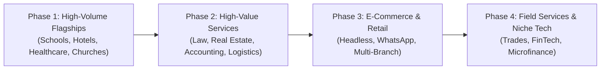

# Redevise Content Strategy: 100+ "Why Your [Business] Needs [Service]" Article Topics

**Master Editorial Framework, Topical Clusters, and Production Roadmap**  
*Document Version: 1.0 | Redevise Optimization Infrastructure*

---

## 1. Executive Strategy & Editorial Architecture

### 1.1 The Power of the "Why Your [Business] Needs [Service]" Angle
Decision-makers (hotel owners, school directors, medical clinic founders, pastors, and enterprise operators) rarely search for abstract concepts like "digital transformation" or "custom APIs." Instead, they search for answers to acute operational pain points:
* *"Why are OTAs taking 20% of my hotel revenue?"* &rarr; **Why your hotel needs SEO & a direct booking engine**
* *"Why are report cards taking our teachers 3 weeks to compile?"* &rarr; **Why your school needs SkulSys**
* *"Why do members miss Sunday services or tithes when traveling?"* &rarr; **Why your church needs Ascribe and mobile giving**

This content formula converts because:
1. **High Commercial Intent:** The reader is already problem-aware and searching for solutions tailored to their specific industry.
2. **Speaks the Language of Outcomes:** It translates technical capabilities (databases, SEO, cloud architecture, bots) into business metrics (direct bookings, fee collection rates, time saved, zero double-bookings).
3. **Cross-Sells the Redevise Dual Engine:**
   - **Internal Products:** Demonstrates ready-to-deploy platforms like **SkulSys / Eduplugg**, **SupporTribe**, **Ascribe**, **StreakMonkey**, and **CitationPro**.
   - **Custom Services (Labs & Consulting):** Offers custom software engineering, workflow automation, payment integration, and local/technical SEO when off-the-shelf software falls short.

---

### 1.2 The Standard Editorial Blueprint: The Calming Evening Read
Every article produced from this list must adhere to Redevise's core human-first standard: **designed for the person pulling up the website in the evening after a long day at work, looking for something calm, relatable, and comforting to read.**

* **Local Currency & Realities:** Always write with the **Ghana Cedi (GH₵)** and localized payment systems (MTN MoMo, Telecel Cash). Anchor examples in real Ghanaian locations and daily realities (Accra traffic, Spintex, East Legon, Kumasi, Takoradi, staff room marking sessions, Sunday morning worship).
* **The "Plain English Friend" Tone:** Write like a practical, intelligent friend speaking over a cold drink. No technical intimidation, no academic stiffness, and zero corporate buzzwords. Anyone should be able to read and understand effortlessly.
* **Vary the Entry Hook (Avoid Monotony):** Never use a single formulaic opening. Rotate naturally across varied hooks:
  - **A Provocative or Reflective Question:** (e.g., *"If you added up every commission deduction on your statements, how much did you actually pay third parties last year?"*)
  - **A Bold Direct Statement:** (e.g., *"An empty clinic chair is the most expensive piece of furniture in private healthcare."*)
  - **A Sharp Cultural or Everyday Truth:** (e.g., *"Hardly anyone in Ghana carries cash anymore."*)
  - **A Counterintuitive Paradox or Humorous Truth:** (e.g., *"Ask any hotel receptionist what takes up most of their day, and they will say: giving out the Wi-Fi password."*)
  - **A Relatable Human Scene:** (e.g., a mother on the sofa looking up schools on her phone after work) — *use selectively, not on every article*.
* **Zero Jargon Rule:** Strictly enforce the `scripts/check-jargon.js` rule—never use banned corporate buzzwords like *seamless, empower, leverage, bespoke, revolutionize, paradigm, holistic,* or *catalyst*.

```
┌─────────────────────────────────────────────────────────────────┐
│ 1. The Varied Hook & Core Operational Bottleneck                │
│    (Question, bold statement, everyday observation, or scene)   │
├─────────────────────────────────────────────────────────────────┤
│ 2. The Real Frustration & Hidden Money Drain                    │
│    (Honest look at lost cedis, wasted time, and burnout)        │
├─────────────────────────────────────────────────────────────────┤
│ 3. What the Solution Actually Does (In Plain English)           │
│    (Simple analogies: a junction signboard, a quiet assistant)  │
├─────────────────────────────────────────────────────────────────┤
│ 4. Clear Walkthrough of How It Works Day-to-Day                 │
│    (Step-by-step practical flow that feels effortless)          │
├─────────────────────────────────────────────────────────────────┤
│ 5. A Simple Look at the Numbers (GH₵ Comparison Table)          │
│    (Clear before vs. after comparison with zero math confusion) │
├─────────────────────────────────────────────────────────────────┤
│ 6. A Warm, Low-Pressure Invitation                             │
│    (Friendly next steps: Project Estimator, Process, or Chat)   │
└─────────────────────────────────────────────────────────────────┘
```

---

## 2. Redevise Offerings & Vertical Matrix

| Product / Service | Core Value Proposition | Primary Target Sectors |
| :--- | :--- | :--- |
| **Local & Technical SEO** | Dominate Google Map pack and high-intent local searches; bypass third-party middleman fees | Hotels, Clinics, Schools, Law Firms, Real Estate, Field Services |
| **Custom Websites & Portals** | Blazing-fast, conversion-engineered digital launchpads with integrated client portals | Private Schools, Property Developers, High-End Venues, Law Firms |
| **SkulSys / Eduplugg** | Modular school management: automated grading, student portal, mobile money fees, SMS attendance | K-12 Private Schools, International Schools, Colleges, Academies |
| **SupporTribe** | Intelligent multi-channel support inbox, automated ticket routing, and SLA tracking | E-commerce, Hotels, Logistics, Healthcare Clinics, SaaS startups |
| **Ascribe** | Modern worship presentation, volunteer rota scheduling, and multi-campus media sync | Churches, Ministries, Faith-Based Non-Profits, Cathedrals |
| **StreakMonkey** | Behavioral consistency, team routine tracking, and client habit gamification | Fitness Studios, Wellness Centers, Corporate Training Teams |
| **CitationPro** | Frictionless academic referencing, plagiarism guardrails, and brief formatting | Universities, Law Firms, Research Consultancies, Graduate Schools |
| **Workflow Automation & Bots** | WhatsApp auto-responders, automated PDF generation, cross-system syncing | Car Rentals, Courier Services, Field Contractors, E-commerce |
| **Payment & FinTech Integrations**| Mobile Money (MTN MoMo, Telecel), Stripe, Paystack checkout & recurring billing | Schools, Gyms, Subscription Businesses, Microfinance, Property Management |
| **Custom Business Dashboards** | Custom back-office software, inventory control, and multi-branch analytics | Wholesalers, Restaurants, Haulage Companies, Construction Firms |

---

## 3. Directory of 121 Article Topics

### Category 1: Hospitality, Tourism & Food Service (Topics 1 – 12)

#### 1. Why Your Hotel Needs SEO: How to Escape the 20% OTA Commission Trap
* **Target Audience:** Independent Hotel Owners, Boutique Resort Managers, General Managers.
* **The Core Bottleneck:** Over-reliance on Booking.com and Expedia, forfeiting 18–25% of top-line revenue per reservation.
* **Redevise Offering:** Local & Technical SEO + Google Business Profile optimization.
* **Measurable ROI:** Shifting 35% of bookings from third-party channels to direct reservations within 6 months.
* **Slug:** `/blog/why-your-hotel-needs-seo-direct-bookings`

#### 2. Why Your Hotel Needs a Custom Direct Booking Engine
* **Target Audience:** Boutique Hotel Operators, Eco-Lodges, Luxury Guest Houses.
* **The Core Bottleneck:** Outdated contact forms or slow third-party booking widgets that cause mobile drop-offs.
* **Redevise Offering:** Redevise Labs Custom Web Development + Instant Booking API.
* **Measurable ROI:** Doubling mobile reservation conversions and capturing zero-commission guest payments.
* **Slug:** `/blog/why-your-hotel-needs-direct-booking-engine`

#### 3. Why Your Hotel Needs WhatsApp Guest Automation
* **Target Audience:** Front Office Managers, Hospitality Operations Heads.
* **The Core Bottleneck:** Front desks overwhelmed by repetitive inquiries (Wi-Fi passwords, breakfast hours, checkout times).
* **Redevise Offering:** Custom WhatsApp Chatbot & Automated Guest Concierge.
* **Measurable ROI:** 70% reduction in routine front desk phone calls; instant check-in instructions sent automatically.
* **Slug:** `/blog/why-your-hotel-needs-whatsapp-guest-automation`

#### 4. Why Your Boutique Resort Needs a Custom Mobile Guest App
* **Target Audience:** Luxury Resort Operators, Safari Lodges, Wellness Retreats.
* **The Core Bottleneck:** Physical brochures and paper room service menus getting damaged, outdated, and ignored.
* **Redevise Offering:** Redevise Labs Mobile App Development (iOS & Android).
* **Measurable ROI:** 40% increase in on-property spa and dining upsells through one-click in-app requests.
* **Slug:** `/blog/why-your-boutique-resort-needs-mobile-guest-app`

#### 5. Why Your Restaurant Needs a Digital QR Ordering & Payment System
* **Target Audience:** Restaurant Owners, Lounge Managers, Multi-Branch Food Franchises.
* **The Core Bottleneck:** Waiters spending 15 minutes per table running back and forth with physical menus, bills, and card terminals.
* **Redevise Offering:** Custom Digital Ordering Web App + Mobile Money/Card Integration.
* **Measurable ROI:** 18-minute faster table turnaround during peak dinner rushes and 100% elimination of menu print costs.
* **Slug:** `/blog/why-your-restaurant-needs-digital-qr-ordering`

#### 6. Why Your Hotel Needs Multi-Currency & Local Mobile Money Payments
* **Target Audience:** Hoteliers in Emerging Markets, Regional Lodging Groups.
* **The Core Bottleneck:** Losing local domestic travelers who prefer Mobile Money (MoMo) and international travelers who need USD/EUR credit card processing.
* **Redevise Offering:** Unified Payment Gateway Integration (Stripe + Paystack + MTN/Telecel MoMo).
* **Measurable ROI:** 28% drop in abandoned checkout sessions during holiday peak periods.
* **Slug:** `/blog/why-your-hotel-needs-multicurrency-mobile-money-payments`

#### 7. Why Your Event Center Needs an Automated Deposit & Booking Calendar
* **Target Audience:** Banquet Hall Managers, Wedding Venue Directors, Conference Center Operators.
* **The Core Bottleneck:** Double-booking prestigious dates on physical wall planners and chasing clients manually for date-hold deposits.
* **Redevise Offering:** Custom Venue Booking & Deposit Automation System.
* **Measurable ROI:** 100% prevention of date collisions; automatic contract generation and deposit reminders.
* **Slug:** `/blog/why-your-event-venue-needs-automated-booking-calendar`

#### 8. Why Your Short-Let Business Needs Multi-Calendar Sync Software
* **Target Audience:** Airbnb Hosts, Serviced Apartment Property Managers.
* **The Core Bottleneck:** Accidental double-bookings across Airbnb, VRBO, and direct inquiries resulting in cancellation penalties and bad reviews.
* **Redevise Offering:** Custom Centralized Channel Manager & Availability Sync.
* **Measurable ROI:** Zero double-booking fines; automated cleaning staff scheduling based on checkout webhooks.
* **Slug:** `/blog/why-your-short-let-business-needs-multicalendar-sync`

#### 9. Why Your Hotel Needs an Automated Guest Review Funnel
* **Target Audience:** Hotel Marketing Directors, Hospitality Brand Managers.
* **The Core Bottleneck:** Unhappy guests complain loudly on TripAdvisor while 90% of delighted guests never leave a review.
* **Redevise Offering:** Automated Post-Stay SMS/WhatsApp Feedback Funnel & Review Booster.
* **Measurable ROI:** 4x increase in 5-star Google & TripAdvisor reviews within 90 days.
* **Slug:** `/blog/why-your-hotel-needs-automated-guest-review-funnel`

#### 10. Why Your Restaurant Chain Needs Centralized Kitchen Inventory Management
* **Target Audience:** Food & Beverage Directors, Multi-Location Restaurant Founders.
* **The Core Bottleneck:** Food wastage, inventory shrinkage, and manual stock counts between branches leading to stockouts.
* **Redevise Offering:** Custom Cloud Inventory & Recipe Costing Dashboard.
* **Measurable ROI:** 6–10% reduction in food waste and automated purchase orders when stock reaches reorder levels.
* **Slug:** `/blog/why-your-restaurant-chain-needs-centralized-kitchen-inventory`

#### 11. Why Your Travel Agency Needs a Custom Itinerary & Quotation Builder
* **Target Audience:** Tour Operators, Destination Management Companies (DMCs).
* **The Core Bottleneck:** Spending 3 to 5 hours copying and pasting flight, hotel, and tour details into static Word documents for each client inquiry.
* **Redevise Offering:** Interactive Digital Proposal & Dynamic Pricing Builder.
* **Measurable ROI:** Turnaround time for custom travel packages cut from 24 hours to 15 minutes; higher booking close rates.
* **Slug:** `/blog/why-your-travel-agency-needs-custom-itinerary-builder`

#### 12. Why Your Hotel Needs SupporTribe: Unifying Inquiries Across Channels
* **Target Audience:** Hotel Customer Service Supervisors, Group Hospitality Directors.
* **The Core Bottleneck:** Guest inquiries slipping through the cracks between Instagram DMs, email, website chat, and WhatsApp.
* **Redevise Offering:** **SupporTribe** Customer Support Intelligence Platform.
* **Measurable ROI:** First response time lowered from 4 hours to under 3 minutes; zero lost reservation leads.
* **Slug:** `/blog/why-your-hotel-needs-supportribe-unified-inbox`

---

### Category 2: Education & Academic Institutions (Topics 13 – 27)

#### 13. Why Your School Needs a Modern Website: The First Hurdle in Parent Enrollment
* **Target Audience:** School Proprietors, Board of Trustees, Headmasters.
* **The Core Bottleneck:** An outdated or non-responsive website that gives prospective parents the impression that the school is academically behind.
* **Redevise Offering:** Redevise Labs High-Performance School Web Design & CMS.
* **Measurable ROI:** 45% increase in online admission inquiries and virtual tour requests.
* **Slug:** `/blog/why-your-school-needs-a-modern-website`

#### 14. Why Your School Needs SkulSys: Ending the End-of-Term Report Card Nightmare
* **Target Audience:** Principals, Academic Directors, Head Teachers.
* **The Core Bottleneck:** Teachers spending nights manually computing grades across fragmented Excel sheets, resulting in calculation errors and delayed report cards.
* **Redevise Offering:** **SkulSys / Eduplugg** School Operations Platform.
* **Measurable ROI:** Report cards compiled, audited, and published in 2 clicks; 80 hours saved per teacher per term.
* **Slug:** `/blog/why-your-school-needs-skulsys-school-management`

#### 15. Why Your School Needs Automated Tuition & Mobile Money Fee Collection
* **Target Audience:** School Bursars, Financial Controllers, Owners.
* **The Core Bottleneck:** Cash theft risks, long bank deposit queues for parents, and bursars manually matching bank tellers to student rolls.
* **Redevise Offering:** Automated Fee Collection via SkulSys (Mobile Money + Card Gateway Integration).
* **Measurable ROI:** Tuition collection rates jump to 96% by midterm; instant automated SMS payment receipts sent to parents.
* **Slug:** `/blog/why-your-school-needs-automated-tuition-fee-collection`

#### 16. Why Your School Needs a Parent Portal Instead of Frantic WhatsApp Groups
* **Target Audience:** School Administrators, Parent-Teacher Association (PTA) Executives.
* **The Core Bottleneck:** Chaotic WhatsApp parent groups where urgent administrative notices get drowned in chatter and arguments.
* **Redevise Offering:** SkulSys Secure Parent Portal & Broadcast System.
* **Measurable ROI:** Centralized communication hub for attendance, grades, homework, and fee balances with zero spam.
* **Slug:** `/blog/why-your-school-needs-parent-portal-communication`

#### 17. Why Your Private School Needs a Local SEO Strategy
* **Target Audience:** Private School Proprietors, Enrollment Directors.
* **The Core Bottleneck:** Relying entirely on word-of-mouth while new families moving into the city search Google for "best primary school in [City]".
* **Redevise Offering:** Local SEO, Google Map Pack Dominance, and Targeted Landing Pages.
* **Measurable ROI:** Ranking in the top 3 on Google Maps for local school searches; 50+ new parent leads per term.
* **Slug:** `/blog/why-your-private-school-needs-local-seo`

#### 18. Why Your School Needs an Automated Timetable & Class Scheduling Engine
* **Target Audience:** Academic Coordinators, Vice Principals.
* **The Core Bottleneck:** Weeks of manual trial-and-error scheduling leading to teacher double-bookings, lab conflicts, and disgruntled staff.
* **Redevise Offering:** Custom Algorithmic Timetabling System inside SkulSys.
* **Measurable ROI:** Conflict-free master timetable generated in under 5 minutes; instant schedule updates pushed to teacher phones.
* **Slug:** `/blog/why-your-school-needs-automated-class-scheduling`

#### 19. Why Your College Needs a Digital Admissions & Document Processing Portal
* **Target Audience:** College Registrars, University Admissions Officers.
* **The Core Bottleneck:** Physical paper application forms getting lost, unreadable handwriting, and slow manual transcript verification.
* **Redevise Offering:** Custom Digital Admissions Portal & Document Upload Pipeline.
* **Measurable ROI:** 60% faster application processing; automatic applicant notification at each evaluation stage.
* **Slug:** `/blog/why-your-college-needs-digital-admissions-portal`

#### 20. Why Your School Needs Instant Digital Attendance & Parent SMS Alerts
* **Target Audience:** School Principals, Discipline Masters, Student Welfare Officers.
* **The Core Bottleneck:** Truancy and unexcused absences going unnoticed until parents receive a shocking call weeks later.
* **Redevise Offering:** SkulSys RFID / Biometric / Mobile App Attendance with Automated SMS Triggers.
* **Measurable ROI:** Truancy drops by 75%; parents receive immediate peace-of-mind confirmation of their child's arrival.
* **Slug:** `/blog/why-your-school-needs-digital-attendance-sms-alerts`

#### 21. Why Your Tutoring Center Needs a Student Progress Tracking Dashboard
* **Target Audience:** Test Prep Directors, Tutoring Agency Founders.
* **The Core Bottleneck:** Parents questioning tuition value because they cannot visually track their child's test score improvements.
* **Redevise Offering:** Custom Student Analytics & Performance Visualizer.
* **Measurable ROI:** 30% boost in student retention; graphical score trajectories shared automatically with parents every month.
* **Slug:** `/blog/why-your-tutoring-center-needs-progress-dashboard`

#### 22. Why Your Daycare Needs a Child Safety & Daily Activity Mobile App
* **Target Audience:** Creche Owners, Early Childhood Development Directors.
* **The Core Bottleneck:** Anxious parents constantly calling teachers during work hours to ask if their toddler has eaten, napped, or taken medicine.
* **Redevise Offering:** Custom Daily Care Mobile App (Activity logs, photo sharing, incident reports).
* **Measurable ROI:** Eliminates midday administrative phone disruptions; transforms parent satisfaction into glowing local referrals.
* **Slug:** `/blog/why-your-daycare-needs-child-safety-activity-app`

#### 23. Why Your International School Needs Virtual Campus Tours & Interactive Funnels
* **Target Audience:** Heads of International Schools, Admissions Marketing Leads.
* **The Core Bottleneck:** Diaspora and expatriate families deciding on relocation cannot visit campus in person before enrollment deadlines.
* **Redevise Offering:** 360-Degree Interactive Virtual Tour & Multi-Currency Application Portal.
* **Measurable ROI:** Capturing high-tuition expatriate admissions 6 months prior to their physical arrival in country.
* **Slug:** `/blog/why-your-international-school-needs-virtual-campus-tours`

#### 24. Why Your Academic Faculty Needs CitationPro for Research Productivity
* **Target Audience:** University Deans, Graduate School Directors, Research Supervisors.
* **The Core Bottleneck:** Faculty and postgrads wasting hundreds of hours formatting APA/MLA/Chicago bibliographies manually and fixing citation errors.
* **Redevise Offering:** **CitationPro** Research Extension & Institutional License.
* **Measurable ROI:** Cuts thesis formatting time by 80%; guarantees academic integrity and compliance.
* **Slug:** `/blog/why-your-academic-faculty-needs-citationpro`

#### 25. Why Your School Needs Cloud-Based Student Records Instead of Paper Folders
* **Target Audience:** School Board Members, Administrators.
* **The Core Bottleneck:** Decades of physical student records vulnerable to fire, flooding, termite damage, or misplacement in filing cabinets.
* **Redevise Offering:** Secure Cloud Student Information System (SIS) with Bank-Grade Encryption.
* **Measurable ROI:** Zero document loss; instant retrieval of 10-year-old transcripts in seconds; full regulatory compliance.
* **Slug:** `/blog/why-your-school-needs-cloud-student-records`

#### 26. Why Your Vocational Institute Needs Tamper-Proof Digital Certificate Verification
* **Target Audience:** Technical College Principals, Certification Board Directors.
* **The Core Bottleneck:** Employers unable to verify vocational certificates, leaving graduates vulnerable to fake credential scandals.
* **Redevise Offering:** QR-Verifiable Digital Certificate & Credentialing Infrastructure.
* **Measurable ROI:** Instant online employer verification; protects the institutional reputation and boosts graduate employment rates.
* **Slug:** `/blog/why-your-vocational-institute-needs-digital-certificate-verification`

#### 27. Why Your School Needs Centralized Staff Payroll & Compliance Automation
* **Target Audience:** School Bursars, HR Administrators.
* **The Core Bottleneck:** Manual calculation of teacher allowances, social security deductions, and income tax withholdings leading to payday delays.
* **Redevise Offering:** SkulSys Integrated Staff Payroll & Direct Bank/MoMo Disbursement.
* **Measurable ROI:** Payday processing reduced from 3 days to 15 minutes with automated digital payslips sent via email.
* **Slug:** `/blog/why-your-school-needs-staff-payroll-automation`

---

### Category 3: Healthcare, Medical & Wellness (Topics 28 – 39)

#### 28. Why Your Private Clinic Needs an Online Appointment Booking Engine
* **Target Audience:** Medical Clinic Directors, Practice Managers.
* **The Core Bottleneck:** Overwhelmed receptionists leaving patients on hold, resulting in frustrated patients hanging up and calling competitors.
* **Redevise Offering:** 24/7 Self-Service Medical Appointment Booking System with Doctor Calendar Sync.
* **Measurable ROI:** 40% of appointments booked after clinic hours; zero receptionist phone bottlenecks during morning rush.
* **Slug:** `/blog/why-your-private-clinic-needs-online-appointment-booking`

#### 29. Why Your Dental Practice Needs Local SEO & Google Business Profile Optimization
* **Target Audience:** Dentists, Dental Clinic Owners.
* **The Core Bottleneck:** Emergency dental patients search "emergency dentist near me" and only visit clinics appearing in the top 3 Google Map pack.
* **Redevise Offering:** Local Dental SEO, Schema Markup, and Review Acceleration.
* **Measurable ROI:** 60% increase in high-value private patient inquiries (implants, orthodontics, cosmetic veneers).
* **Slug:** `/blog/why-your-dental-practice-needs-local-seo`

#### 30. Why Your Clinic Needs WhatsApp Automated Appointment Reminders
* **Target Audience:** Outpatient Clinic Coordinators, Specialists.
* **The Core Bottleneck:** 20–30% patient no-show rates, leaving doctors with dead time and causing substantial revenue loss.
* **Redevise Offering:** Automated 2-Way WhatsApp Appointment Reminders & Instant Rescheduling Bot.
* **Measurable ROI:** No-show rate slashed from 25% down to under 6%; cancelled slots automatically offered to waitlisted patients.
* **Slug:** `/blog/why-your-clinic-needs-whatsapp-appointment-reminders`

#### 31. Why Your Diagnostic Lab Needs a Secure Patient Result Portal
* **Target Audience:** Pathology Lab Owners, Diagnostic Center Directors.
* **The Core Bottleneck:** Patients forced to travel back to the lab just to pick up a paper lab report, creating crowded waiting rooms.
* **Redevise Offering:** HIPAA/GDPR-Compliant Secure Patient Portal with SMS/Email PDF Delivery.
* **Measurable ROI:** Eliminates printing and counter distribution costs; delivers critical results to physicians hours faster.
* **Slug:** `/blog/why-your-diagnostic-lab-needs-secure-patient-portal`

#### 32. Why Your Community Pharmacy Needs a WhatsApp Prescription Refill Bot
* **Target Audience:** Pharmacy Owners, Retail Pharmacists.
* **The Core Bottleneck:** Chronic medication patients forgetting to refill until they run out, or queuing endlessly at peak refill times.
* **Redevise Offering:** Custom WhatsApp Prescription Refill & Delivery Dispatch Bot.
* **Measurable ROI:** 35% increase in recurring monthly prescription loyalty; automated dispatch for home delivery.
* **Slug:** `/blog/why-your-pharmacy-needs-whatsapp-refill-bot`

#### 33. Why Your Specialist Practice Needs a Custom Telemedicine Video Platform
* **Target Audience:** Consultants, Pediatricians, Dermatologists, Psychiatrists.
* **The Core Bottleneck:** Patients struggling with long commutes and traffic, limiting the clinic's reach strictly to immediate neighbors.
* **Redevise Offering:** Secure, Browser-Based Telemedicine Portal with Integrated Payment.
* **Measurable ROI:** Expands consult capacity by 30%; pre-collects consultation fees before the video session starts.
* **Slug:** `/blog/why-your-specialist-practice-needs-telemedicine-platform`

#### 34. Why Your Mental Health Clinic Needs Digital Intake & Assessment Forms
* **Target Audience:** Clinical Psychologists, Therapy Group Practice Directors.
* **The Core Bottleneck:** Clients spending the first 15 minutes of a paid session filling out physical paper intake sheets in the waiting room.
* **Redevise Offering:** Encrypted, Pre-Session Digital Intake & Clinical Assessment Workflows.
* **Measurable ROI:** Therapists review clinical context before the session begins; zero physical paperwork scanning overhead.
* **Slug:** `/blog/why-your-mental-health-clinic-needs-digital-intake-forms`

#### 35. Why Your Hospital Needs SupporTribe for Patient Inquiries & Triage
* **Target Audience:** Hospital Patient Relations Managers, Hospital Operations Officers.
* **The Core Bottleneck:** General billing questions, visiting hour inquiries, and urgent medical concerns all dumped into one unorganized email inbox.
* **Redevise Offering:** **SupporTribe** Healthcare Desk with Automated Keyword Triage & SLA Alerts.
* **Measurable ROI:** Priority medical emergencies routed within seconds; 5x faster resolution of routine administrative queries.
* **Slug:** `/blog/why-your-hospital-needs-supportribe-patient-triage`

#### 36. Why Your Physiotherapy Center Needs a Custom Patient Exercise Recovery App
* **Target Audience:** Physical Therapy Practice Owners, Sports Rehab Specialists.
* **The Core Bottleneck:** Patients forgetting home exercise routines taught during sessions, slowing down recovery and dropping out of therapy.
* **Redevise Offering:** Custom White-Label Video Exercise & Routine Tracking Mobile App.
* **Measurable ROI:** 70% increase in patient home exercise compliance; higher course-of-care completion rates.
* **Slug:** `/blog/why-your-physiotherapy-center-needs-patient-exercise-app`

#### 37. Why Your Multi-Branch Pharmacy Needs Centralized Inventory Sync
* **Target Audience:** Chain Pharmacy Directors, Medical Supply Operators.
* **The Core Bottleneck:** Branch A turning away a desperate customer for an out-of-stock medication while Branch B has 50 boxes expiring on the shelf.
* **Redevise Offering:** Real-Time Multi-Location Pharmacy ERP & Inventory Sync.
* **Measurable ROI:** Eliminates drug expiration waste by 22%; allows cross-branch order fulfillment on the spot.
* **Slug:** `/blog/why-your-multi-branch-pharmacy-needs-centralized-inventory`

#### 38. Why Your Aesthetic Medical Clinic Needs a High-Converting Before-and-After Portfolio Site
* **Target Audience:** Cosmetic Surgeons, Dermatologists, Medical Spa Owners.
* **The Core Bottleneck:** High consultation bounce rates due to vague descriptions that lack verified, privacy-compliant visual proof of results.
* **Redevise Offering:** HIPAA-Compliant Before-and-After Interactive Gallery Web Architecture.
* **Measurable ROI:** 2.5x increase in consultation deposits; builds immediate clinical credibility.
* **Slug:** `/blog/why-your-aesthetic-clinic-needs-visual-portfolio-site`

#### 39. Why Your Medical Practice Needs Automated Insurance Claims Tracking
* **Target Audience:** Medical Billers, Healthcare Practice Business Managers.
* **The Core Bottleneck:** Tens of thousands of dollars locked in pending health insurance claims due to minor coding errors and delayed dispute follow-ups.
* **Redevise Offering:** Custom Claims Tracking & Rejection Alert Pipeline.
* **Measurable ROI:** Average accounts receivable turnaround reduced from 65 days to 24 days.
* **Slug:** `/blog/why-your-medical-practice-needs-insurance-claims-tracking`

---

### Category 4: Faith-Based & Religious Organizations (Topics 40 – 49)

#### 40. Why Your Church Needs Ascribe: Eliminating Sunday Morning Presentation Glitches
* **Target Audience:** Senior Pastors, Worship Leaders, Church Media Directors.
* **The Core Bottleneck:** Outdated presentation software crashing mid-service, missing song verses, or displaying wrong scripture translations.
* **Redevise Offering:** **Ascribe** Modern Church Worship Presentation & Media Software.
* **Measurable ROI:** Flawless multi-screen transitions; cloud-synced lyrics and scriptures controllable from a tablet.
* **Slug:** `/blog/why-your-church-needs-ascribe-presentation-software`

#### 41. Why Your Church Needs a Dedicated Mobile App for Member Engagement
* **Target Audience:** Church Administrators, Pastoral Care Teams.
* **The Core Bottleneck:** Members losing touch during the week; printed church bulletins discarded in the parking lot.
* **Redevise Offering:** Custom Church Mobile App (Push devotions, sermon audio, prayer request wall).
* **Measurable ROI:** 3x higher midweek engagement; instant notifications for emergency prayer or service updates.
* **Slug:** `/blog/why-your-church-needs-dedicated-mobile-app`

#### 42. Why Your Ministry Needs Automated Online Giving & Mobile Money Tithing
* **Target Audience:** Church Treasurers, Finance Committees, Senior Pastors.
* **The Core Bottleneck:** Giving dropping by 40% on rainy Sundays or when diaspora members travel, alongside cash counting security vulnerabilities.
* **Redevise Offering:** Multi-Channel Giving Infrastructure (Mobile Money USSD + Web + Recurring Card Debits).
* **Measurable ROI:** Stable year-round tithing; automated tax and contribution statements generated for members.
* **Slug:** `/blog/why-your-church-needs-online-giving-mobile-money`

#### 43. Why Your Church Needs a Modern Website: Reaching the Next Generation
* **Target Audience:** Pastors, Church Communication Directors.
* **The Core Bottleneck:** Newcomers moving into the community check Google first; if the church website looks abandoned, they visit another fellowship.
* **Redevise Offering:** Modern, Inviting Church Web Presence with "Plan Your Visit" Funnel.
* **Measurable ROI:** 50% increase in first-time visitor turnout; clear service times, parking directions, and children's church info.
* **Slug:** `/blog/why-your-church-needs-a-modern-website`

#### 44. Why Your Church Needs Volunteer Scheduling & Rota Automation
* **Target Audience:** Ministry Coordinators, Choir Directors, Usheering Leads.
* **The Core Bottleneck:** Frantic Saturday night phone calls trying to find replacement sound technicians, musicians, and Sunday school teachers.
* **Redevise Offering:** Automated Volunteer Scheduling & WhatsApp Confirmation System.
* **Measurable ROI:** Volunteer no-shows reduced by 85%; volunteers confirm or swap shifts with one click.
* **Slug:** `/blog/why-your-church-needs-volunteer-scheduling-automation`

#### 45. Why Your Ministry Needs a Video-on-Demand & Sermon Archive Platform
* **Target Audience:** Media Pastors, International Evangelists.
* **The Core Bottleneck:** Decades of life-changing sermon recordings scattered across USB drives, CDs, and disorganized YouTube uploads.
* **Redevise Offering:** Custom Searchable Sermon Archive with Topic, Scripture, and Speaker Tagging.
* **Measurable ROI:** Members can search and listen to specific teachings on demand; global digital outreach expansion.
* **Slug:** `/blog/why-your-ministry-needs-video-on-demand-sermon-archive`

#### 46. Why Your Church Needs a Member Directory & Pastoral Care CRM
* **Target Audience:** Executive Pastors, Department Heads.
* **The Core Bottleneck:** First-time visitors never contacted after filling a paper visitor card; sick or struggling members forgotten.
* **Redevise Offering:** Custom Church Member Management & Pastoral Care Workflow.
* **Measurable ROI:** 100% of first-time guests receive personalized follow-up within 24 hours; systematic tracking of baptisms and home visits.
* **Slug:** `/blog/why-your-church-needs-member-directory-pastoral-crm`

#### 47. Why Your Multi-Branch Ministry Needs Centralized Media & Brand Infrastructure
* **Target Audience:** General Overseers, National Administrative Bishops.
* **The Core Bottleneck:** Satellite branches projecting poor-quality, inconsistent graphics, incorrect announcements, and misaligned logos.
* **Redevise Offering:** Multi-Campus Cloud Media Hub via Ascribe.
* **Measurable ROI:** Headquarters pushes unified sermon slides, videos, and announcements to 50+ satellite campuses in real-time.
* **Slug:** `/blog/why-your-ministry-needs-centralized-media-infrastructure`

#### 48. Why Your Church Needs an Automated WhatsApp Newcomer Follow-Up Funnel
* **Target Audience:** Evangelism Directors, Follow-Up Committees.
* **The Core Bottleneck:** 70% of first-time church visitors never return because follow-up calls feel awkward or arrive two weeks too late.
* **Redevise Offering:** Gentle, Multi-Week WhatsApp Welcome Sequence & Feedback Survey.
* **Measurable ROI:** Doubling visitor-to-member retention within 60 days.
* **Slug:** `/blog/why-your-church-needs-whatsapp-newcomer-follow-up`

#### 49. Why Your Bible College Needs SkulSys for Ministry Curriculum Management
* **Target Audience:** Seminary Presidents, Bible Institute Registrars.
* **The Core Bottleneck:** Managing modular theology degree tracks, diploma cohorts, and ministry practicals on paper registers.
* **Redevise Offering:** **SkulSys / Eduplugg** Configured for Higher Education & Seminaries.
* **Measurable ROI:** Frictionless course registration, student grade tracking, and ordination verification.
* **Slug:** `/blog/why-your-bible-college-needs-skulsys`

---

### Category 5: Real Estate, Property & Construction (Topics 50 – 60)

#### 50. Why Your Real Estate Agency Needs an SEO Strategy: Winning High-Value Property Searches
* **Target Audience:** Real Estate Brokers, Agency Managing Directors.
* **The Core Bottleneck:** Paying exorbitant listing fees to third-party property portals while losing direct buyer leads.
* **Redevise Offering:** High-Intent Real Estate SEO (Targeting "apartments for sale in [Neighborhood]").
* **Measurable ROI:** Capturing direct buyer inquiries, saving tens of thousands in external lead generation fees.
* **Slug:** `/blog/why-your-real-estate-agency-needs-seo`

#### 51. Why Your Property Development Firm Needs an Off-Plan Interactive Sales Portal
* **Target Audience:** Real Estate Developers, Commercial Property Syndicates.
* **The Core Bottleneck:** Selling units off-plan to overseas or diaspora buyers using static PDF brochures that fail to convey space and luxury.
* **Redevise Offering:** Interactive 3D Unit Availability Visualizer & Digital Reservation System.
* **Measurable ROI:** Units reserved 3x faster; international buyers can select specific floors and reserve units instantly.
* **Slug:** `/blog/why-your-property-firm-needs-offplan-sales-portal`

#### 52. Why Your Property Management Company Needs an Automated Rent Collection Portal
* **Target Audience:** Landlords, Estate Managers, Commercial Property Supervisors.
* **The Core Bottleneck:** Chasing dozens of tenants every month for rent payments, manually issuing paper receipts, and disputing utility bill splits.
* **Redevise Offering:** Tenant Portal with Automated Rent Invoicing, Mobile Money/Card Integration, and Auto-Receipts.
* **Measurable ROI:** 90% on-time rent payment; automatic late fee calculations and transparent ledger for owners.
* **Slug:** `/blog/why-your-property-management-company-needs-automated-rent-collection`

#### 53. Why Your Facility Management Firm Needs a QR Maintenance Ticketing System
* **Target Audience:** Facility Directors, Commercial Building Operations Heads.
* **The Core Bottleneck:** Maintenance requests reported via chaotic hallway conversations or lost emails, causing AC breakdowns and tenant fury.
* **Redevise Offering:** QR-Based Maintenance Ticketing (Tenants scan QR sticker on equipment to log an issue).
* **Measurable ROI:** Mean time to repair (MTTR) slashed by 45%; clear audit trail of technician accountability.
* **Slug:** `/blog/why-your-facility-firm-needs-qr-maintenance-ticketing`

#### 54. Why Your Estate Agency Needs a Custom CRM with WhatsApp Lead Auto-Responders
* **Target Audience:** Real Estate Sales Directors, Top Producing Agents.
* **The Core Bottleneck:** High-net-worth buyers browse properties late at night; if an inquiry sits unanswered until morning, they move to another agent.
* **Redevise Offering:** Custom Real Estate CRM + Instant WhatsApp Property Brochure Bot.
* **Measurable ROI:** Inquiries answered within 10 seconds with property specs and floor plans; 3x increase in inspection bookings.
* **Slug:** `/blog/why-your-estate-agency-needs-whatsapp-crm-automation`

#### 55. Why Your Short-Let Management Agency Needs Dynamic Pricing Software
* **Target Audience:** Serviced Apartment Operators, Portfolio Managers.
* **The Core Bottleneck:** Charging fixed nightly rates all year round, leaving thousands on the table during holiday peaks and sitting empty during off-seasons.
* **Redevise Offering:** Custom Algorithmic Dynamic Pricing & Yield Management Engine.
* **Measurable ROI:** 20–35% increase in annual RevPAR (Revenue Per Available Room).
* **Slug:** `/blog/why-your-short-let-agency-needs-dynamic-pricing`

#### 56. Why Your Construction Company Needs a Client Milestone & Progress Dashboard
* **Target Audience:** General Contractors, Civil Engineering Firm Partners.
* **The Core Bottleneck:** Clients constantly demanding photo updates and budget justifications, leading to adversarial disputes over variations.
* **Redevise Offering:** Client Transparency Dashboard (Photo logs, milestone sign-offs, variation order tracking).
* **Measurable ROI:** Eliminates payment delays on project milestones; builds trust that wins lucrative repeat developer contracts.
* **Slug:** `/blog/why-your-construction-company-needs-client-progress-dashboard`

#### 57. Why Your Commercial Landlord Firm Needs Lease Compliance Monitoring Software
* **Target Audience:** Commercial Asset Managers, Real Estate Investment Trusts (REITs).
* **The Core Bottleneck:** Missing critical lease expiration dates, rent escalation triggers, and tenant insurance renewal deadlines.
* **Redevise Offering:** Custom Commercial Lease Expiration & Compliance Engine.
* **Measurable ROI:** Zero missed rent escalation clauses; automated reminders 90 days before lease expiries.
* **Slug:** `/blog/why-your-landlord-firm-needs-lease-compliance-monitoring`

#### 58. Why Your Real Estate Brokerage Needs an Automated Property Matchmaking Engine
* **Target Audience:** Brokerage Founders, High-Volume Real Estate Teams.
* **The Core Bottleneck:** Agents forgetting about qualified buyers sitting in old spreadsheets when a perfect new listing enters the market.
* **Redevise Offering:** Automated Buyer-Listing Matchmaker (Instant SMS/Email alerts when a property matches buyer criteria).
* **Measurable ROI:** New listings sold within days to existing buyer databases before spending money on advertising.
* **Slug:** `/blog/why-your-real-estate-brokerage-needs-automated-matchmaking`

#### 59. Why Your Architecture Firm Needs a High-Performance Portfolio Website
* **Target Audience:** Principal Architects, Design Studio Directors.
* **The Core Bottleneck:** Heavy, unoptimized websites that load excruciatingly slowly on mobile, frustrating affluent commercial developers.
* **Redevise Offering:** Modern Headless Architecture Portfolio (Blazing speed, interactive blueprint views, immersive galleries).
* **Measurable ROI:** Sub-second load times that keep high-value investors engaged; elevated prestige positioning.
* **Slug:** `/blog/why-your-architecture-firm-needs-high-performance-portfolio`

#### 60. Why Your Property Valuation Firm Needs Automated Inspection & Report Generation
* **Target Audience:** Chartered Surveyors, Valuation Firm Directors.
* **The Core Bottleneck:** Surveyors taking handwritten notes in the field, then spending 2 days typing up formal valuation reports in the office.
* **Redevise Offering:** Mobile Field Survey App with Automated PDF Valuation Report Generation.
* **Measurable ROI:** Report turnaround time slashed from 48 hours to 2 hours; surveyor throughput doubled.
* **Slug:** `/blog/why-your-valuation-firm-needs-automated-report-generation`

---

### Category 6: Professional Services: Legal, Accounting & Consulting (Topics 61 – 72)

#### 61. Why Your Law Firm Needs Technical SEO: Winning High-Value Corporate Retainers
* **Target Audience:** Managing Partners, Law Firm Marketing Directors.
* **The Core Bottleneck:** Relying entirely on old-school networks while modern CFOs and founders search Google for specialized corporate lawyers.
* **Redevise Offering:** Technical Legal SEO, Practice-Area Content Architecture, and Authority Building.
* **Measurable ROI:** Consistent inflow of inbound corporate inquiries for IP, litigation, and regulatory compliance.
* **Slug:** `/blog/why-your-law-firm-needs-technical-seo`

#### 62. Why Your Accounting Firm Needs a Secure Client Document Portal
* **Target Audience:** Senior Partners, CPA Firm Managers, Tax Consultants.
* **The Core Bottleneck:** Clients emailing sensitive bank statements, payroll sheets, and tax documents as unencrypted attachments.
* **Redevise Offering:** End-to-End Encrypted Client Document Upload & Review Portal.
* **Measurable ROI:** Eliminates security breach liabilities; cuts client document chase time during tax season by 50%.
* **Slug:** `/blog/why-your-accounting-firm-needs-secure-client-portal`

#### 63. Why Your Recruitment Agency Needs a Custom Applicant Tracking System (ATS)
* **Target Audience:** Staffing Firm Founders, Talent Acquisition Directors.
* **The Core Bottleneck:** Paying thousands in monthly seat licenses for generic ATS tools that don't match local hiring pipelines or CV formats.
* **Redevise Offering:** Redevise Labs Custom ATS with Automated Resume Parsing and WhatsApp Interview Alerts.
* **Measurable ROI:** Eliminates recurring software seat costs; speeds up candidate shortlisting by 65%.
* **Slug:** `/blog/why-your-recruitment-agency-needs-custom-ats`

#### 64. Why Your Law Firm Needs CitationPro: Accelerating Legal Brief Writing
* **Target Audience:** Senior Advocates, Litigators, Law Firm Associates.
* **The Core Bottleneck:** Junior associates spending countless unbillable hours manually checking statutory references, court citations, and footnote styles.
* **Redevise Offering:** **CitationPro** Configured for Legal Citation Formatting and Cross-Referencing.
* **Measurable ROI:** Cuts legal brief citation drafting time in half; eliminates citation errors in court submissions.
* **Slug:** `/blog/why-your-law-firm-needs-citationpro`

#### 65. Why Your Management Consulting Firm Needs Interactive ROI Assessment Tools
* **Target Audience:** Strategy Partners, Boutique Consulting Directors.
* **The Core Bottleneck:** Boring white papers that prospective enterprise clients download but never read.
* **Redevise Offering:** Interactive Digital Assessment Tool (Prospects input their operational metrics and receive a custom diagnostic score).
* **Measurable ROI:** 5x higher lead qualification rate; discovery calls grounded in real prospect data before the first meeting.
* **Slug:** `/blog/why-your-consulting-firm-needs-interactive-roi-tools`

#### 66. Why Your HR Consultancy Needs a White-Label Employee Onboarding Portal
* **Target Audience:** HR Outsourcing Leaders, People Operations Consultants.
* **The Core Bottleneck:** Onboarding new client hires via scattered emails, paper contracts, and manual policy acknowledgments.
* **Redevise Offering:** Custom Digital Employee Onboarding System with E-Signature and Video Training Flows.
* **Measurable ROI:** Reduces new hire administrative onboarding time from 2 weeks to 24 hours; 100% compliance audit readiness.
* **Slug:** `/blog/why-your-hr-consultancy-needs-onboarding-portal`

#### 67. Why Your Engineering Firm Needs an Interactive Project Cost Estimator
* **Target Audience:** Civil & Structural Engineering Firm Principals.
* **The Core Bottleneck:** Wasting dozens of senior partner hours preparing comprehensive quotes for tire-kicker leads with zero budget.
* **Redevise Offering:** Interactive Online Project Scope & Cost Estimator.
* **Measurable ROI:** Pre-qualifies high-value clients before discovery calls; weeds out unviable leads automatically.
* **Slug:** `/blog/why-your-engineering-firm-needs-project-cost-estimator`

#### 68. Why Your Law Firm Needs an Automated Client Intake & Conflict-Check System
* **Target Audience:** Law Firm Practice Managers, Senior Partners.
* **The Core Bottleneck:** Manual conflict-of-interest checks taking days, stalling new client engagements and risking severe ethics violations.
* **Redevise Offering:** Automated Conflict-Check Database Search & Digital Client Intake Workflow.
* **Measurable ROI:** Conflict checks completed in 60 seconds; new matter onboarding completed on day one.
* **Slug:** `/blog/why-your-law-firm-needs-automated-client-intake`

#### 69. Why Your Accounting Practice Needs an Automated Invoice Chasing Bot
* **Target Audience:** Managing Accountants, Audit Firm Partners.
* **The Core Bottleneck:** Senior partners awkwardly having to chase clients for overdue advisory fees, damaging client relationships.
* **Redevise Offering:** Automated, Multi-Tiered WhatsApp & Email Account Receivable Chaser.
* **Measurable ROI:** Overdue receivables reduced by 40% without awkward human confrontations.
* **Slug:** `/blog/why-your-accounting-practice-needs-automated-invoice-chasing`

#### 70. Why Your Advisory Firm Needs SupporTribe to Separate SLAs from Ad-Hoc Requests
* **Target Audience:** IT Consultants, Advisory Partners, Retainer Service Providers.
* **The Core Bottleneck:** Retainer clients demanding immediate responses for out-of-scope tasks via personal WhatsApp messages.
* **Redevise Offering:** **SupporTribe** Client Support Desk with Tiered SLA Enforcement.
* **Measurable ROI:** Clear boundary between billable out-of-scope work and SLA retainers; zero lost client requests.
* **Slug:** `/blog/why-your-advisory-firm-needs-supportribe-sla-desk`

#### 71. Why Your Professional Firm Needs a Thought Leadership Knowledge Base
* **Target Audience:** Firm Managing Partners, Subject Matter Experts.
* **The Core Bottleneck:** Proprietary frameworks and regulatory insights buried in internal folders instead of attracting clients online.
* **Redevise Offering:** Fast, Searchable Digital Knowledge Base & Blog Architecture.
* **Measurable ROI:** Generates high-authority backlinks, inbound media requests, and lucrative enterprise consulting inquiries.
* **Slug:** `/blog/why-your-professional-firm-needs-knowledge-base`

#### 72. Why Your Immigration Consultancy Needs a Step-by-Step Visa Tracker
* **Target Audience:** Immigration Lawyers, Visa Consultants.
* **The Core Bottleneck:** Clients constantly calling, texting, and emailing every day asking: *"Any update on my application?"*
* **Redevise Offering:** Client Self-Service Visa Milestone & Document Progress Portal.
* **Measurable ROI:** 80% decrease in repetitive status check inquiries; elevated client peace of mind.
* **Slug:** `/blog/why-your-immigration-consultancy-needs-visa-tracker`

---

### Category 7: Retail, Wholesale & E-Commerce (Topics 73 – 83)

#### 73. Why Your Retail Boutique Needs Local SEO & Google Shopping Integration
* **Target Audience:** Independent Boutique Owners, Specialty Retailers.
* **The Core Bottleneck:** Shoppers walking right past the store because nearby products don't appear in Google "near me" searches.
* **Redevise Offering:** Local SEO + Google Merchant Center Automated Product Feed.
* **Measurable ROI:** 50% increase in qualified local foot traffic looking for specific in-stock items.
* **Slug:** `/blog/why-your-retail-boutique-needs-local-seo-google-shopping`

#### 74. Why Your Multi-Branch Retailer Needs Real-Time Centralized Inventory Sync
* **Target Audience:** Retail Operations Directors, Store Chain Founders.
* **The Core Bottleneck:** Selling the same high-demand item simultaneously in a physical shop and online due to 24-hour sync delays.
* **Redevise Offering:** Real-Time Cloud Inventory Sync across POS and Online Storefronts.
* **Measurable ROI:** Zero overselling penalties; stock transfers between branches automated based on demand.
* **Slug:** `/blog/why-your-retailer-needs-realtime-inventory-sync`

#### 75. Why Your E-Commerce Brand Needs a Headless Storefront: Slashing Page Load Times
* **Target Audience:** DTC Brand Founders, E-Commerce Directors.
* **The Core Bottleneck:** Bloated Shopify themes taking 6 seconds to load on mobile, cutting conversion rates in half.
* **Redevise Offering:** Custom Next.js / React Headless Storefront with Edge Caching.
* **Measurable ROI:** Sub-second page loads; average 35% increase in mobile checkout completions.
* **Slug:** `/blog/why-your-ecommerce-brand-needs-headless-storefront`

#### 76. Why Your Wholesale Business Needs a Private B2B Ordering Portal
* **Target Audience:** Wholesalers, FMCG Distributors, Importers.
* **The Core Bottleneck:** Sales reps taking bulk orders over messy WhatsApp voice notes and scribbled paper order pads.
* **Redevise Offering:** Custom Wholesale B2B Portal (Tiered pricing, minimum order quantities, credit term tracking).
* **Measurable ROI:** Zero order packing errors; bulk buyers reorder 24/7 at their specific negotiated contract prices.
* **Slug:** `/blog/why-your-wholesale-business-needs-b2b-ordering-portal`

#### 77. Why Your E-Commerce Store Needs WhatsApp Automated Order & Delivery Tracking
* **Target Audience:** Online Store Managers, Customer Support Leads.
* **The Core Bottleneck:** 60% of customer support tickets being *"Where is my order? Has it been dispatched yet?"*
* **Redevise Offering:** Automated WhatsApp Dispatch & Real-Time Tracking Notification Bot.
* **Measurable ROI:** 70% reduction in WISMO ("Where Is My Order") support queries; immediate boost in customer trust.
* **Slug:** `/blog/why-your-ecommerce-store-needs-whatsapp-order-tracking`

#### 78. Why Your Supermarket Needs an On-Demand Delivery Mobile App
* **Target Audience:** Grocery Store Owners, Regional Supermarket Chains.
* **The Core Bottleneck:** Surrendering customer data and 15–25% commissions to third-party delivery aggregator apps.
* **Redevise Offering:** Custom White-Label Supermarket Mobile App with Barcode Search & Driver Dispatch.
* **Measurable ROI:** Complete ownership of customer relationships; 100% margin retention on repeat grocery orders.
* **Slug:** `/blog/why-your-supermarket-needs-delivery-mobile-app`

#### 79. Why Your E-Commerce Store Needs WhatsApp Abandoned Cart Recovery
* **Target Audience:** E-Commerce Founders, Digital Marketing Managers.
* **The Core Bottleneck:** 70% of shoppers abandon carts on mobile, and recovery emails have abysmal 15% open rates.
* **Redevise Offering:** Automated WhatsApp Abandoned Cart Recovery Workflow with One-Click Checkout Link.
* **Measurable ROI:** 60%+ open rates on WhatsApp; recovering 20–30% of otherwise lost mobile checkout revenue.
* **Slug:** `/blog/why-your-ecommerce-store-needs-whatsapp-cart-recovery`

#### 80. Why Your Retail Brand Needs SupporTribe for Omnichannel Customer Support
* **Target Audience:** E-Commerce Operations Heads, Customer Service Managers.
* **The Core Bottleneck:** Support agents jumping between Instagram DMs, WhatsApp web, Gmail, and TikTok messages, resulting in 12-hour delays.
* **Redevise Offering:** **SupporTribe** Omnichannel Retail Support Desk.
* **Measurable ROI:** Unified conversation history per customer; average response time under 4 minutes across all social platforms.
* **Slug:** `/blog/why-your-retail-brand-needs-supportribe-omnichannel`

#### 81. Why Your Subscription Brand Needs StreakMonkey to Boost Customer Retention
* **Target Audience:** Wellness DTC Brands, Subscription Box Founders.
* **The Core Bottleneck:** Customers cancel subscriptions after 2 months because they forget to use the product daily.
* **Redevise Offering:** **StreakMonkey** Behavioral Consistency & Habit Engine Integration.
* **Measurable ROI:** Daily product usage habit formed; customer lifetime value (LTV) extended by 4+ months.
* **Slug:** `/blog/why-your-subscription-brand-needs-streakmonkey`

#### 82. Why Your Retail Business Needs a Custom Point-of-Sale (POS) & Back-Office Integration
* **Target Audience:** Brick-and-Mortar Retailers, Multi-Store Managers.
* **The Core Bottleneck:** Off-the-shelf POS software that crashes offline and charges high monthly transaction surcharges.
* **Redevise Offering:** Custom Offline-First POS System with Automated Nightly Reconciliation.
* **Measurable ROI:** Cashiers continue scanning during internet dropouts; instant daily profit and loss auditing.
* **Slug:** `/blog/why-your-retail-business-needs-custom-pos-integration`

#### 83. Why Your Luxury Store Needs a VIP Clienteling & Concierge App
* **Target Audience:** High-End Fashion Boutiques, Luxury Jewelers.
* **The Core Bottleneck:** Inability to track high-spending VIP client preferences, anniversaries, and purchase histories across sales staff.
* **Redevise Offering:** Custom VIP Clienteling Mobile Application for Floor Associates.
* **Measurable ROI:** Personalized anniversary recommendations yielding 40% higher average order values.
* **Slug:** `/blog/why-your-luxury-store-needs-clienteling-concierge-app`

---

### Category 8: Logistics, Transportation & Supply Chain (Topics 84 – 93)

#### 84. Why Your Courier Business Needs Real-Time GPS Tracking & Customer SMS Updates
* **Target Audience:** Delivery Company Founders, Last-Mile Logistics Heads.
* **The Core Bottleneck:** Customers calling constantly asking for their driver's location; failed delivery attempts when customers aren't home.
* **Redevise Offering:** Real-Time Driver Tracking Map & Automated 15-Minute SMS Arrival Alerts.
* **Measurable ROI:** First-attempt delivery success rate rises to 94%; customer inquiry calls decrease by 60%.
* **Slug:** `/blog/why-your-courier-business-needs-gps-tracking-sms`

#### 85. Why Your Haulage Firm Needs Automated Waybill & Dispatch Management
* **Target Audience:** Trucking Company Directors, Fleet Managers.
* **The Core Bottleneck:** Physical paper waybills getting stained, lost, or forged in transit, delaying client invoicing by weeks.
* **Redevise Offering:** Digital Waybill & Proof-of-Delivery (POD) Mobile Application with Photo & Signature Capture.
* **Measurable ROI:** Instant digital proof of delivery; client invoicing triggered the moment the truck unloads.
* **Slug:** `/blog/why-your-haulage-firm-needs-digital-waybills`

#### 86. Why Your Car Rental Business Needs an Online Booking & Fleet Availability Engine
* **Target Audience:** Car Rental Agency Owners, Chauffeur Service Managers.
* **The Core Bottleneck:** Taking bookings on phone calls, leading to double-booked vehicles or renting out cars scheduled for mechanical service.
* **Redevise Offering:** Real-Time Fleet Availability Engine + Identity Verification & Deposit System.
* **Measurable ROI:** 100% fleet utilization visibility; automated security deposit holds and damage inspection records.
* **Slug:** `/blog/why-your-car-rental-needs-online-booking-fleet-engine`

#### 87. Why Your Freight Forwarding Company Needs an Instant Freight Rate Calculator
* **Target Audience:** Freight Forwarders, Cargo Logistics Brokers.
* **The Core Bottleneck:** Taking 48 hours to calculate complex CBM, customs, and air/sea freight rates, losing shipping clients to faster competitors.
* **Redevise Offering:** Instant Digital Freight Rate Calculator & Automated Quotation Generator.
* **Measurable ROI:** Instant freight quotes generated in 30 seconds; 3x increase in quote-to-booking conversions.
* **Slug:** `/blog/why-your-freight-company-needs-instant-rate-calculator`

#### 88. Why Your Warehouse Needs a Barcode-Driven Bin-Location System
* **Target Audience:** Warehouse Managers, Supply Chain Directors.
* **The Core Bottleneck:** Pickers wandering aisles for 20 minutes trying to locate items stored in undocumented locations.
* **Redevise Offering:** Lightweight Barcode-Driven Warehouse Management System (WMS).
* **Measurable ROI:** Pick-and-pack times cut by 55%; 99.8% shipping accuracy.
* **Slug:** `/blog/why-your-warehouse-needs-barcode-bin-location-system`

#### 89. Why Your Inter-City Bus Service Needs a Digital Seat Booking & E-Ticketing System
* **Target Audience:** Transport Operators, Bus Terminal Managers.
* **The Core Bottleneck:** Overcrowded ticketing counters, ticket touts skimming cash, and buses leaving with empty unbooked seats.
* **Redevise Offering:** Online Seat Selection & Mobile Money E-Ticketing Platform.
* **Measurable ROI:** 70% of tickets purchased online in advance; zero cash skimming; predictable route scheduling.
* **Slug:** `/blog/why-your-bus-service-needs-digital-seat-booking`

#### 90. Why Your Moving & Relocation Company Needs Local SEO & an Instant Moving Estimator
* **Target Audience:** Moving Company Owners, Relocation Specialists.
* **The Core Bottleneck:** Competing solely on cheap prices because clients cannot easily estimate room-by-room moving costs online.
* **Redevise Offering:** Local SEO Dominance + Interactive Room-by-Room Moving Quote Calculator.
* **Measurable ROI:** Captures clients when they sign home leases; delivers qualified moving contracts with predefined item inventories.
* **Slug:** `/blog/why-your-moving-company-needs-local-seo-quote-estimator`

#### 91. Why Your Supply Chain Business Needs a Supplier Performance Tracking Dashboard
* **Target Audience:** Procurement Directors, Supply Chain Analysts.
* **The Core Bottleneck:** Unreliable suppliers constantly delivering late without documented metrics, causing production delays.
* **Redevise Offering:** Custom Supplier SLA & On-Time In-Full (OTIF) Performance Dashboard.
* **Measurable ROI:** Data-backed contract negotiations; supplier delivery delays reduced by 30%.
* **Slug:** `/blog/why-your-supply-chain-needs-supplier-performance-dashboard`

#### 92. Why Your Cold Chain Logistics Fleet Needs IoT Temperature Monitoring Alerts
* **Target Audience:** Pharmaceutical Distributors, Perishable Food Transporters.
* **The Core Bottleneck:** Refrigeration unit failures during transit discovered only upon delivery, resulting in ruined cargo worth thousands.
* **Redevise Offering:** IoT Sensor Dashboard with Instant SMS/WhatsApp Temperature Breach Alerts.
* **Measurable ROI:** Drivers intervene before cargo spoils; automated compliance temperature logs for regulatory audits.
* **Slug:** `/blog/why-your-cold-chain-fleet-needs-iot-temperature-monitoring`

#### 93. Why Your Dispatch Service Needs a WhatsApp Booking & Pickup Bot
* **Target Audience:** On-Demand Dispatch Companies, Bike Delivery Services.
* **The Core Bottleneck:** Dispatchers juggling dozens of incoming calls trying to record pickup addresses, phone numbers, and package sizes.
* **Redevise Offering:** Automated WhatsApp Dispatch Request Bot (Geolocates sender and generates driver job cards).
* **Measurable ROI:** Dispatcher handles 5x more orders per hour; automated pricing based on kilometer distance.
* **Slug:** `/blog/why-your-dispatch-service-needs-whatsapp-booking-bot`

---

### Category 9: Fitness, Sports & Personal Wellness (Topics 94 – 103)

#### 94. Why Your Gym Needs a Custom Member Mobile App: Replacing Plastic RFID Cards
* **Target Audience:** Gym Owners, Fitness Center Operators.
* **The Core Bottleneck:** Members losing physical scan tags or sharing cards with non-paying friends; front desk clogged during morning rush.
* **Redevise Offering:** Custom Member Mobile App with Dynamic QR Code Check-In and Class Schedule.
* **Measurable ROI:** Zero pass-sharing fraud; 3-second turnstile check-ins.
* **Slug:** `/blog/why-your-gym-needs-member-mobile-app`

#### 95. Why Your Personal Training Studio Needs StreakMonkey for Client Consistency
* **Target Audience:** Studio Owners, Elite Personal Trainers.
* **The Core Bottleneck:** Clients working out hard for 3 weeks, skipping sessions, losing motivation, and eventually canceling memberships.
* **Redevise Offering:** **StreakMonkey** Habit & Routine Accountability Integration.
* **Measurable ROI:** Client training consistency increases by 50%; membership renewal rates hit 85%+.
* **Slug:** `/blog/why-your-pt-studio-needs-streakmonkey`

#### 96. Why Your Yoga / Pilates Studio Needs an Automated Waitlist & Booking Engine
* **Target Audience:** Boutique Studio Founders, Pilates Instructors.
* **The Core Bottleneck:** Classes showing "full" while last-minute cancellations leave empty reformer spots that could have generated revenue.
* **Redevise Offering:** Automated Class Waitlist Engine (Instantly SMS waitlisted clients when a spot opens).
* **Measurable ROI:** 98% class capacity utilization; zero empty reformer beds.
* **Slug:** `/blog/why-your-pilates-studio-needs-automated-waitlist-engine`

#### 97. Why Your Martial Arts / Dance Academy Needs SkulSys for Belt Gradings & Dues
* **Target Audience:** Martial Arts Senseis, Academy Directors, Dance Studio Heads.
* **The Core Bottleneck:** Tracking student syllabus requirements, attendance thresholds for gradings, and monthly dues in paper registers.
* **Redevise Offering:** **SkulSys / Eduplugg** Adapted for Martial Arts & Academy Belt Progression.
* **Measurable ROI:** Automated qualification alerts when students are ready for belt exams; recurring tuition collected automatically.
* **Slug:** `/blog/why-your-martial-arts-academy-needs-skulsys`

#### 98. Why Your CrossFit Box Needs a Community Workout-of-the-Day (WOD) Platform
* **Target Audience:** CrossFit Box Owners, Head Coaches.
* **The Core Bottleneck:** Athletes recording PRs (personal records) in personal notebooks with no shared community leaderboard.
* **Redevise Offering:** Custom Digital WOD & Community Leaderboard App.
* **Measurable ROI:** Builds sticky gym culture and friendly competition; churn drops significantly.
* **Slug:** `/blog/why-your-crossfit-box-needs-wod-community-platform`

#### 99. Why Your Turf Pitch / Sports Complex Needs Online Booking & Deposit Automation
* **Target Audience:** Sports Facility Owners, 5-a-Side Turf Operators.
* **The Core Bottleneck:** Teams booking prime evening slots over the phone and then failing to show up, leaving pitches empty.
* **Redevise Offering:** Real-Time Hourly Pitch Reservation & Mandatory Online Deposit System.
* **Measurable ROI:** Eliminates pitch no-shows entirely; upfront payment collection via Mobile Money and cards.
* **Slug:** `/blog/why-your-sports-complex-needs-online-pitch-booking`

#### 100. Why Your Day Spa Needs an Automated Package & Subscription Billing System
* **Target Audience:** Spa Directors, Aesthetic Wellness Operators.
* **The Core Bottleneck:** Unpredictable seasonal revenue peaks and valleys instead of steady, dependable cash flow.
* **Redevise Offering:** Recurring Monthly Wellness Membership Billing Engine.
* **Measurable ROI:** Secures predictable monthly recurring revenue (MRR); members visit consistently for monthly treatments.
* **Slug:** `/blog/why-your-day-spa-needs-automated-membership-billing`

#### 101. Why Your Fitness Club Needs Automated WhatsApp Churn Prevention Sequences
* **Target Audience:** Gym General Managers, Retention Officers.
* **The Core Bottleneck:** Members gradually stopping their gym visits; management only notices when the member cancels their direct debit 3 months later.
* **Redevise Offering:** Automated Check-In Gap Detector (Triggers motivational WhatsApp check-in after 10 days of absence).
* **Measurable ROI:** 25% of at-risk members re-engage before canceling their membership.
* **Slug:** `/blog/why-your-fitness-club-needs-churn-prevention-automation`

#### 102. Why Your Youth Sports Academy Needs a Parent Communication & Scout Portal
* **Target Audience:** Football/Basketball Academy Directors, Youth Sports Coaches.
* **The Core Bottleneck:** Academy scouts unable to view verified match footage, physical stats, and academic standing in one clean dossier.
* **Redevise Offering:** Custom Youth Athlete Dossier & Match Analytics Portal.
* **Measurable ROI:** Attracts international scout interest; keeps parents updated with match schedules and performance metrics.
* **Slug:** `/blog/why-your-sports-academy-needs-athlete-scout-portal`

#### 103. Why Your Dietitian Practice Needs a Custom Meal Plan & Habit App
* **Target Audience:** Registered Dietitians, Nutrition Coaches.
* **The Core Bottleneck:** Sending static PDF meal plans via email that clients lose; checking food diaries through messy WhatsApp photos.
* **Redevise Offering:** Interactive Nutrition & Meal Check-In Web/Mobile App.
* **Measurable ROI:** Doubles client dietary compliance; coaches review client meal logs in seconds.
* **Slug:** `/blog/why-your-dietitian-practice-needs-meal-planning-app`

---

### Category 10: Trades, Field Services & Contractors (Topics 104 – 113)

#### 104. Why Your HVAC Company Needs Local SEO: Dominating Emergency Seasonal Searches
* **Target Audience:** HVAC Contractors, Air Conditioning Repair Business Owners.
* **The Core Bottleneck:** During heatwaves or cold snaps, homeowners frantically search "AC repair near me" and call the first company on Google Maps.
* **Redevise Offering:** Local Map Pack SEO, High-Converting Emergency Landing Pages, and Schema Markup.
* **Measurable ROI:** Ranks in the top 3 on Google for emergency cooling/heating searches; doubles seasonal service calls.
* **Slug:** `/blog/why-your-hvac-company-needs-local-seo`

#### 105. Why Your Plumbing Business Needs Mobile Job Dispatch & On-Site Invoicing
* **Target Audience:** Master Plumbers, Plumbing Business Operators.
* **The Core Bottleneck:** Technicians scribbling handwritten invoices in their vans; office staff taking days to mail invoices and collect payments.
* **Redevise Offering:** Mobile Field App (Technician logs parts, creates PDF invoice, and collects card/MoMo payment on-site).
* **Measurable ROI:** Eliminates bad debts; same-day cash collection; saves 15 hours of office bookkeeping per week.
* **Slug:** `/blog/why-your-plumbing-business-needs-mobile-job-dispatch`

#### 106. Why Your Commercial Cleaning Company Needs an Automated Proposal & Estimator Tool
* **Target Audience:** Commercial Cleaning Firm Owners, Janitorial Contractors.
* **The Core Bottleneck:** Spending hours manually measuring square footage and typing custom cleaning bids for office buildings.
* **Redevise Offering:** Custom Commercial Cleaning Bid Calculator & Automatic Contract Generator.
* **Measurable ROI:** Professional proposals generated in 10 minutes on-site; wins contracts over slower competitors.
* **Slug:** `/blog/why-your-cleaning-company-needs-automated-bid-calculator`

#### 107. Why Your Solar Installation Company Needs an Interactive Solar Savings Calculator
* **Target Audience:** Solar EPC Contractors, Renewable Energy Founders.
* **The Core Bottleneck:** Educating skeptical homeowners on payback periods and electricity bill reductions takes multiple sales visits.
* **Redevise Offering:** Interactive Solar ROI & Monthly Savings Calculator on the Company Website.
* **Measurable ROI:** Generates pre-qualified leads with roof size, current electric bill, and budget already submitted.
* **Slug:** `/blog/why-your-solar-company-needs-interactive-savings-calculator`

#### 108. Why Your Roofing Company Needs a Visual Inspection & Insurance Report Portal
* **Target Audience:** Roofing Contractors, Storm Restoration Specialists.
* **The Core Bottleneck:** Homeowners and insurance adjusters disputing storm damage claims without clear, timestamped photographic proof.
* **Redevise Offering:** Drone & Mobile Photo Inspection Portal with Automated Insurance Claim Dossiers.
* **Measurable ROI:** Insurance claims approved 50% faster; closes high-ticket roof replacement contracts with visual proof.
* **Slug:** `/blog/why-your-roofing-company-needs-inspection-report-portal`

#### 109. Why Your Security Guarding Firm Needs a GPS & NFC Patrol Verification App
* **Target Audience:** Private Security Company Directors, Operations Officers.
* **The Core Bottleneck:** Clients suspecting security guards are sleeping during night shifts rather than patrolling perimeter checkpoints.
* **Redevise Offering:** Mobile Guard Patrol App (Guards tap NFC tags at checkpoints; logs GPS and timestamp).
* **Measurable ROI:** 100% indisputable proof of patrol delivered to clients in daily automated reports; secures enterprise corporate contracts.
* **Slug:** `/blog/why-your-security-firm-needs-guard-patrol-verification`

#### 110. Why Your Pest Control Business Needs Automated Recurring Service Scheduling
* **Target Audience:** Pest Control Operators, Exterminator Firm Owners.
* **The Core Bottleneck:** One-off treatment calls that never convert into steady, recurring quarterly maintenance contracts.
* **Redevise Offering:** Automated Seasonal Recurring Maintenance Pipeline with SMS Reminders.
* **Measurable ROI:** 45% increase in annual contract renewals; predictable offseason revenue.
* **Slug:** `/blog/why-your-pest-control-business-needs-recurring-scheduling`

#### 111. Why Your Auto Repair Workshop Needs a WhatsApp Vehicle Progress & Approval Bot
* **Target Audience:** Independent Garage Owners, Auto Body Shop Managers.
* **The Core Bottleneck:** Mechanics pausing repairs for hours waiting for a customer to call back to approve additional brake or suspension parts.
* **Redevise Offering:** Automated WhatsApp Repair Status Bot with Photo/Video Part Approval.
* **Measurable ROI:** Customers approve repairs in minutes from their phone; vehicle bays clear 35% faster.
* **Slug:** `/blog/why-your-auto-workshop-needs-whatsapp-repair-approval`

#### 112. Why Your Electrical Contracting Firm Needs Apprentice Hours & Safety Compliance Software
* **Target Audience:** Electrical Contractors, Engineering Operations Directors.
* **The Core Bottleneck:** Paper safety checklists and apprentice logbooks lost on construction sites, risking regulatory fines.
* **Redevise Offering:** Digital Daily Safety Briefing & Apprentice Hours Sign-Off Mobile Tool.
* **Measurable ROI:** 100% OSHA/regulatory audit compliance; eliminates manual paperwork consolidation at headquarters.
* **Slug:** `/blog/why-your-electrical-contracting-firm-needs-compliance-software`

#### 113. Why Your Landscaping & Lawn Care Business Needs Route Optimization Software
* **Target Audience:** Landscaping Business Owners, Grounds Maintenance Contractors.
* **The Core Bottleneck:** Crew trucks zig-zagging inefficiently across town, burning excess fuel and wasting billable daylight.
* **Redevise Offering:** Algorithmic Daily Route Optimization & Crew Dispatch System.
* **Measurable ROI:** 22% fuel cost reduction; crews fit in 2 extra residential properties per day.
* **Slug:** `/blog/why-your-landscaping-business-needs-route-optimization`

---

### Category 11: Financial Services, Cooperatives & FinTech (Topics 114 – 121)

#### 114. Why Your Microfinance Institution Needs a Cloud Loan Origination & Scoring System
* **Target Audience:** Microfinance CEOs, Credit Officers, Managing Directors.
* **The Core Bottleneck:** Manual paper loan applications taking 7–14 days to review, during which good borrowers go elsewhere.
* **Redevise Offering:** Custom Digital Loan Origination System with Automated Credit Scoring & Mobile Money Disbursement.
* **Measurable ROI:** Loan turnaround cut from 10 days to 2 hours; credit officer portfolio capacity increased by 3x.
* **Slug:** `/blog/why-your-microfinance-institution-needs-cloud-loan-origination`

#### 115. Why Your Susu / Thrift Scheme Needs Mobile Money Automated Daily Collections
* **Target Audience:** Credit Union Managers, Savings Cooperative Executives, Susu Collectors.
* **The Core Bottleneck:** Field agents carrying bags of physical cash face armed robbery risks and manual ledger reconciliation discrepancies.
* **Redevise Offering:** Automated Daily Mobile Money Pull / USSD Thrift Collection Engine.
* **Measurable ROI:** 100% elimination of cash theft; daily collections reconciled automatically into core banking.
* **Slug:** `/blog/why-your-thrift-scheme-needs-automated-momo-collections`

#### 116. Why Your Investment Cooperative Needs a Member Portal & Dividend Statement Generator
* **Target Audience:** Cooperative Executives, Credit Union Secretaries.
* **The Core Bottleneck:** Members distrusting board management because they must physically travel to the head office to see their dividend shares.
* **Redevise Offering:** Transparent Member Investment Portal with One-Click Digital Dividend Statements.
* **Measurable ROI:** Complete financial transparency; member capital deposits surge by 40% due to elevated trust.
* **Slug:** `/blog/why-your-investment-cooperative-needs-member-portal`

#### 117. Why Your Debt Collection Agency Needs an Automated Self-Service Payment Portal
* **Target Audience:** Collections Agency Directors, Credit Risk Managers.
* **The Core Bottleneck:** Debtors ignoring aggressive phone calls while feeling too embarrassed to discuss payments with human collectors.
* **Redevise Offering:** Discreet Self-Service Debt Settlement & Flexible Payment Plan Portal.
* **Measurable ROI:** 28% increase in debt recoveries; borrowers set up affordable recurring repayment plans without phone conflict.
* **Slug:** `/blog/why-your-debt-agency-needs-self-service-settlement-portal`

#### 118. Why Your Forex Bureau Needs a Live Digital Rate Board & WhatsApp Alert Bot
* **Target Audience:** Currency Exchange Owners, Treasury Desk Managers.
* **The Core Bottleneck:** Manual chalkboard rate displays that cannot adjust quickly to volatile market fluctuations, costing margin.
* **Redevise Offering:** Cloud-Synced Digital Rate Displays & VIP WhatsApp Rate Alert Broadcast Bot.
* **Measurable ROI:** Instant margin protection during currency swings; corporate clients execute large exchanges when their target rate is reached.
* **Slug:** `/blog/why-your-forex-bureau-needs-digital-rate-board-whatsapp`

#### 119. Why Your Insurance Brokerage Needs Automated Policy Renewal Reminders
* **Target Audience:** Independent Insurance Brokers, General Agency Heads.
* **The Core Bottleneck:** 20% of auto and business policyholders unintentionally lapse every year simply because nobody reminded them in time.
* **Redevise Offering:** Multi-Channel WhatsApp & SMS Automated Policy Expiry Renewal Pipeline.
* **Measurable ROI:** Policy retention climbs to 93%; protects recurring commission renewals without manual broker calling.
* **Slug:** `/blog/why-your-insurance-brokerage-needs-automated-renewal-reminders`

#### 120. Why Your FinTech Startup Needs Bank-Grade Data Isolation & Immutable Audit Logging
* **Target Audience:** FinTech CTOs, Compliance Officers, FinTech Founders.
* **The Core Bottleneck:** Failing central bank or payment partner security audits due to shared databases and incomplete change audit trails.
* **Redevise Offering:** Redevise Labs Bank-Grade PostgreSQL Architecture, Tenant Data Isolation, and Write-Once Audit Trails.
* **Measurable ROI:** 100% first-pass regulatory compliance audit clearance; builds institutional investor confidence.
* **Slug:** `/blog/why-your-fintech-startup-needs-bank-grade-audit-logging`

#### 121. Why Your Micro-Lending Company Needs Automated SMS/WhatsApp Payment Due Alerts
* **Target Audience:** Retail Lenders, Payday Loan Providers.
* **The Core Bottleneck:** Borrowers defaulting simply because payday passed without a timely repayment reminder.
* **Redevise Offering:** Proactive 3-Day, 1-Day, and Day-Of WhatsApp Due Date Alerts with Direct Payment Links.
* **Measurable ROI:** 30-day delinquency rates drop by 38%; borrowers click the WhatsApp link to pay immediately via Mobile Money.
* **Slug:** `/blog/why-your-microlending-company-needs-whatsapp-payment-alerts`

---

## 4. Production Phasing & Rollout Strategy

To maximize SEO equity and lead generation, publish articles in 4 strategic phases based on business priority and product readiness:



### Sprint Breakdown:
1. **Sprint 1 (Weeks 1–3): Core B2B Flagships**
   * Priority: **Schools (SkulSys / Eduplugg)**, **Hotels (SEO & Direct Booking)**, and **Churches (Ascribe & Giving)**.
   * *Target Articles:* 1, 2, 3, 13, 14, 15, 16, 40, 41, 42.
2. **Sprint 2 (Weeks 4–6): High-Value Professional Services & Medical**
   * Priority: **Clinics (Booking & Portals)**, **Law Firms (SEO & CitationPro)**, and **Real Estate (Portals & SEO)**.
   * *Target Articles:* 28, 29, 30, 50, 51, 52, 61, 62, 64.
3. **Sprint 3 (Weeks 7–9): Commerce, Support & Retention**
   * Priority: **E-commerce (SupporTribe & Headless)**, **Fitness (StreakMonkey)**, and **Logistics (GPS & Dispatch)**.
   * *Target Articles:* 73, 74, 75, 77, 80, 84, 85, 94, 95.
4. **Sprint 4 (Weeks 10–12): Field Services, FinTech & Operations**
   * Priority: **Trades (HVAC, Plumbing, Solar)** and **Financial Services (Loans & Mobile Money)**.
   * *Target Articles:* 104, 105, 107, 114, 115, 119, 120.

---

## 5. Multi-Channel Distribution & Repurposing Engine

Never treat an article as a one-and-done blog post. Each article serves as an intellectual asset across Redevise's client acquisition flywheel:

```
                  ┌───────────────────────────────────────────────┐
                  │ Core Article: "Why Your [X] Needs [Y]"        │
                  └──────────────────────┬────────────────────────┘
                                         │
       ┌──────────────────┬──────────────┴─────┬──────────────────┐
       ▼                  ▼                    ▼                  ▼
┌──────────────┐   ┌──────────────┐     ┌──────────────┐   ┌──────────────┐
│  LinkedIn    │   │  WhatsApp    │     │  Direct Cold │   │  Interactive │
│  Carousel    │   │  Executive   │     │  Outreach    │   │  Lead Magnet │
│  Slide Deck  │   │  Summary     │     │  Email Asset │   │  PDF / Audit │
└──────────────┘   └──────────────┘     └──────────────┘   └──────────────┘
```

1. **LinkedIn Thought Leadership Carousels:** Condense Section 1 (The Bottleneck) and Section 5 (The ROI Benchmarks) into a 7-slide visual PDF carousel targeting industry decision-makers on LinkedIn.
2. **Executive WhatsApp Summaries:** A 3-paragraph executive takeaway with a link to the article, sent directly to prospective hotel GMs, principals, or clinic directors.
3. **Sales Enablement & Cold Outreach:** When pitching a school or hotel, the sales team shares the exact article: *"We recently analyzed the real cost of manual report card processing in private schools — thought you might find this benchmark useful."*
4. **Interactive Lead Magnet:** Embed links within each article to Redevise's interactive [Project Cost Estimator](/estimate) and operational audit inquiry forms.
